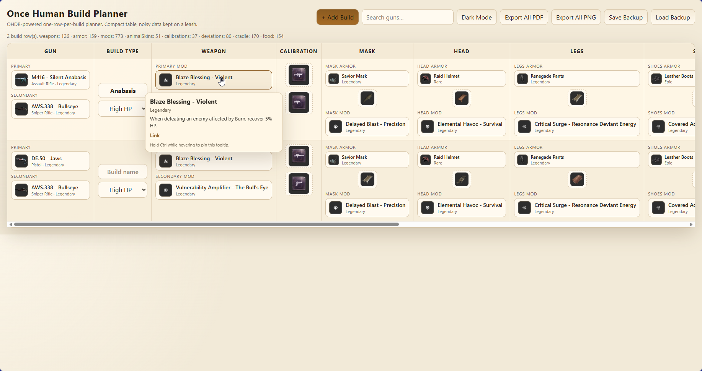
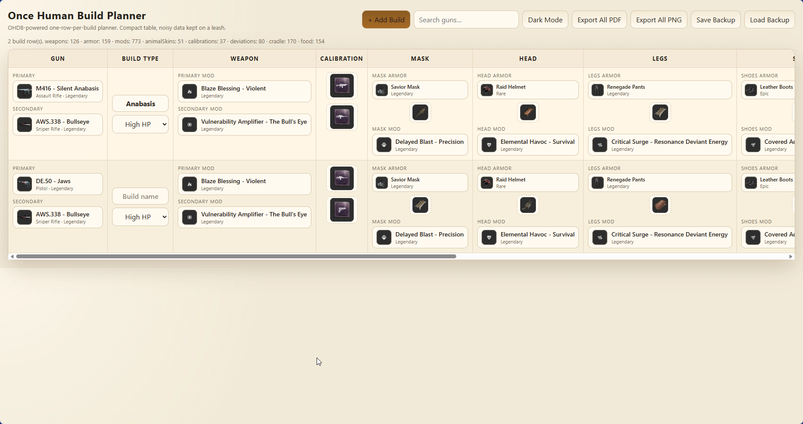
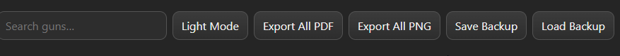
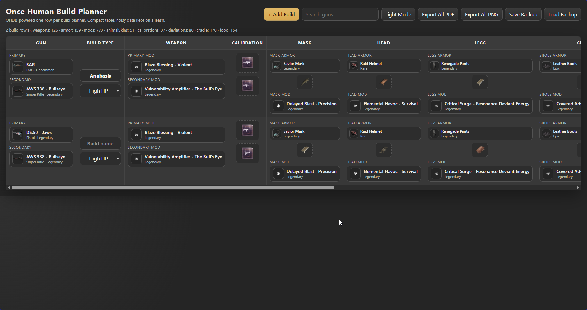
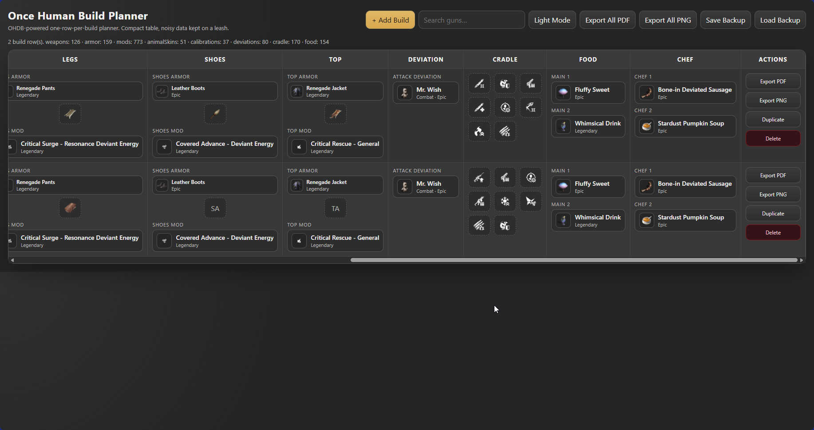
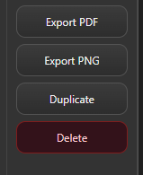
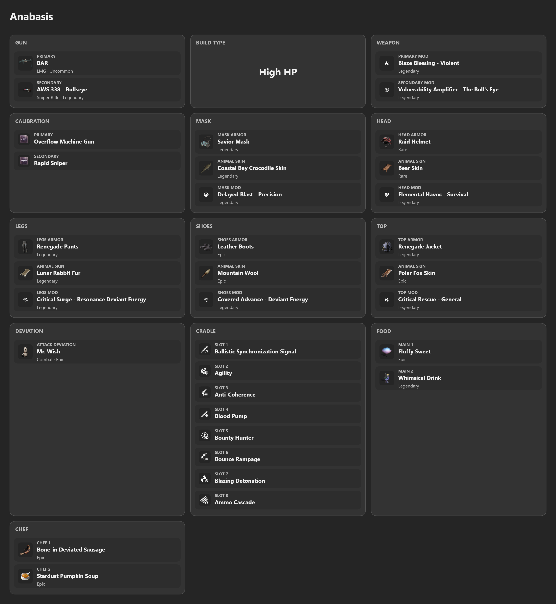
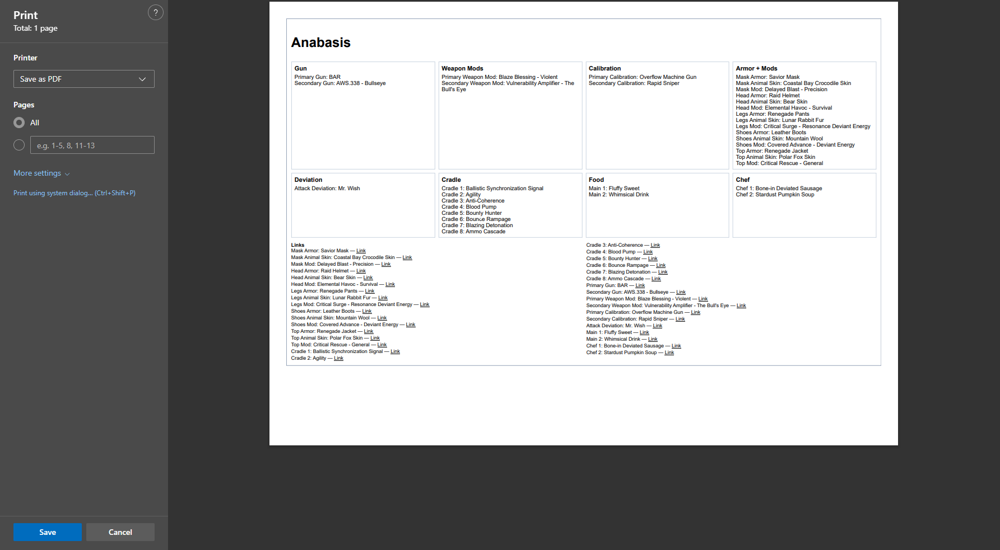

# Once Human Build Planner

Static one-page build planner for **Once Human** gun builds, using [OHDB / Once Human Database](https://www.oncehumandb.com/) as the source data.

The app is built for quick loadout planning: one row per build, compact selectors, hover tooltips, local browser saves, and Discord-friendly exports.



## What it does

- Tracks complete builds in a single horizontal table.
- Stores builds locally in the browser with `localStorage`.
- Uses OHDB-sourced JSON data for weapons, armor, mods, animal skins, calibrations, deviations, cradle overrides, and food.
- Lets each build have a custom name, such as `Anabasis`, which also appears in exports.
- Supports dark and light themes.
- Exports builds as PDF or PNG.
- Includes save/load backup JSON so builds can be moved between browsers or machines.

## Table layout

Each row is one complete build.

| Column | Purpose |
| --- | --- |
| **Gun** | Primary and secondary weapon selectors. |
| **Build Type** | Build name plus `High HP` / `Low HP` type. |
| **Weapon** | Primary and secondary weapon mod selectors. |
| **Calibration** | Primary and secondary calibration icons, stacked vertically. |
| **Mask / Head / Legs / Shoes / Top** | Armor piece, animal skin/fur/hide, and armor mod for each slot. |
| **Deviation** | Combat deviation selector. |
| **Cradle** | 8 compact icon-only cradle override slots. |
| **Food** | Two main food buff slots. |
| **Chef** | Two Chef extra food buff slots. |
| **Actions** | Export, duplicate, or delete a single build row. |



## Main workflow

### 1. Add or name a build

Use **+ Add Build** to create a new row. In the **Build Type** column, set a build name and choose whether the build is `High HP` or `Low HP`.

The build name is used in the table and in PNG/PDF exports.



### 2. Pick guns and weapon mods

Use the **Gun** column for the actual weapons:

- Primary gun
- Secondary gun

Use the **Weapon** column for weapon mods:

- Primary mod
- Secondary mod

The search box at the top filters visible rows by gun name, so larger build lists stay manageable.

### 3. Pick calibrations

The **Calibration** column contains two larger icon-only boxes:

- Top box: Primary calibration
- Bottom box: Secondary calibration

Hovering shows the full calibration name and link when available.

### 4. Configure armor slots

Each armor slot column contains:

1. Armor piece
2. Animal skin / fur / hide
3. Armor mod

The skin/fur/hide selector is centered and icon-only to keep the table compact.



### 5. Select deviation, cradle, food, and chef buffs

The right side of the table handles the supporting build pieces:

- **Deviation**: one combat deviation
- **Cradle**: eight cradle override slots
- **Food**: two main food buffs
- **Chef**: two extra Chef buffs

Cradle slots display as compact icons after selection. Hover the icon to see the name, effect, and source link.



## Tooltips and links

Hover over items to see extra details:

- Item name
- Rarity / type metadata
- Effect text
- OHDB link, where available

Hold **Ctrl** while hovering to pin a tooltip, which makes it easier to click the link without the tooltip vanishing like it has somewhere better to be.


## Row actions

Each build row has its own action buttons:



- **Export PDF**: print/export that single row.
- **Export PNG**: export that single row as a Discord-friendly image.
- **Duplicate**: clone the row to use as a starting point for another build.
- **Delete**: remove the row.

## Exporting

### PNG export

Use **Export PNG** on a row, or **Export All PNG** from the toolbar.

PNG export is designed for Discord sharing and produces a clean card-style layout instead of a wide table screenshot.



### PDF export

Use **Export PDF** on a row, or **Export All PDF** from the toolbar.

The app uses browser print output with A4 landscape sizing:

```css
@page {
  size: A4 landscape;
  margin: 8mm;
}
```

Chrome/Edge usually respect this when saving to PDF. Browser print engines remain browser print engines, because apparently we are still paying for old sins.



## Backup and restore

Use the toolbar buttons:

- **Save Backup** downloads a JSON backup of the current builds.
- **Load Backup** restores builds from a saved JSON backup.

Builds also auto-save locally in the browser, but backups are the safer option before clearing browser data or moving machines.

## Run locally

Because the app loads `data/*.json`, serve the directory instead of opening `index.html` directly:

```bash
cd ~/git/once-human-build-planner
python3 -m http.server 8080
```

Then open:

```text
http://127.0.0.1:8080/
```

## Data files

The app loads these generated files:

```text
data/weapons.json
data/armor.json
data/mods.json
data/animal-skins.json
data/calibrations.json
data/deviations.json
data/cradle.json
data/food.json
```

## Refresh OHDB data

```bash
cd ~/git/once-human-build-planner
python3 tools/refresh-ohdb-data.py
```

Current source pages:

```text
https://www.oncehumandb.com/weapons
https://www.oncehumandb.com/armor
https://www.oncehumandb.com/mods
https://www.oncehumandb.com/deviations
https://www.oncehumandb.com/cradle-overrides
https://www.oncehumandb.com/items
```

## Notes

- The app is dependency-free: one `index.html` plus JSON data files.
- User build data is stored locally; nothing is sent to a backend.
- If item icons look weak in light mode, the UI adds a dark backing behind transparent/white OHDB icons so they stay visible.
